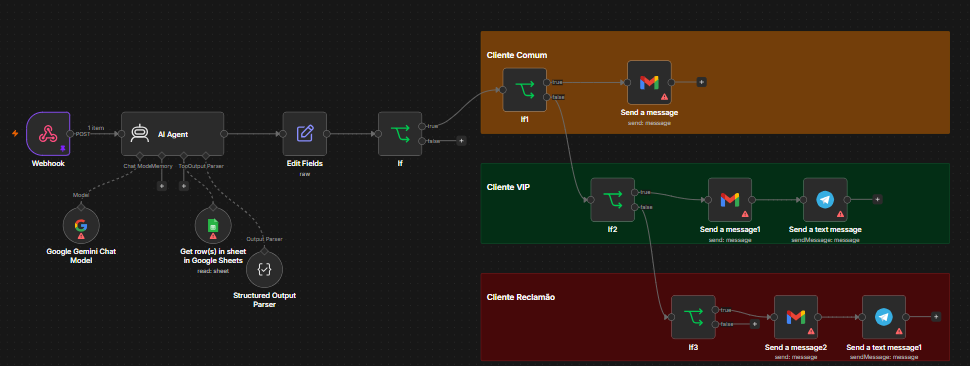

# 💰 Agente Inteligente de Reembolso com IA


## 📖 Sobre o projeto

Sistema inteligente desenvolvido com n8n para automatizar a análise de solicitações de reembolso.

O workflow recebe dados enviados por formulário, utiliza Inteligência Artificial para estruturar as informações, consulta a base de clientes no Google Sheets, calcula o tempo desde a compra, realiza análise de sentimento e aplica regras de negócio.

De acordo com o perfil do cliente e o conteúdo da solicitação, o sistema envia respostas por e-mail ou encaminha o caso para análise humana por meio do Telegram.

## 📷 Preview



## 🎯 Problema resolvido

Processos de reembolso podem exigir várias tarefas manuais:

- leitura de formulários;
- consulta da base de clientes;
- cálculo de prazo;
- identificação de clientes prioritários;
- análise do tom da mensagem;
- envio de respostas;
- encaminhamento de situações críticas.

O projeto centraliza e automatiza essas etapas em um único workflow.

## 🚀 Funcionalidades

- Recebimento de solicitações via Webhook;
- extração estruturada dos dados do formulário;
- consulta de clientes no Google Sheets;
- normalização e busca por e-mail;
- cálculo dos dias desde a última compra;
- análise de sentimento;
- identificação de clientes VIP;
- aplicação de regras de negócio;
- envio automático de e-mails;
- alertas internos pelo Telegram;
- saída estruturada em JSON;
- encaminhamento de casos críticos para análise humana.

## 🧠 Regras principais

### Prazo de garantia

O fluxo verifica se a compra foi realizada dentro ou fora do prazo de 7 dias.

### Cliente VIP

Clientes com valor total gasto superior a R$ 3.000 podem ser encaminhados para uma análise especial.

### Sentimento muito negativo

Comentários agressivos, ameaças ou menções a canais de reclamação são classificados como `muito_negativo` e encaminhados para análise humana.

## 🏗️ Arquitetura

```text
Formulário Tally
       │
       ▼
    Webhook
       │
       ▼
 Agente de IA
   + Gemini
       │
       ├── Consulta Google Sheets
       ├── Análise de sentimento
       ├── Cálculo do prazo
       └── Estruturação em JSON
       │
       ▼
 Regras de negócio
       │
 ┌─────┼──────────────┐
 │     │              │
 ▼     ▼              ▼
Comum  VIP     Muito negativo
 │     │              │
 ▼     ▼              ▼
Gmail  Gmail +        Gmail +
       Telegram       Telegram
```

## 🛠️ Tecnologias

- n8n;
- Google Gemini;
- Google Sheets;
- Gmail;
- Telegram Bot;
- Tally;
- Webhooks;
- JSON;
- Prompt Engineering;
- IA Generativa.

## 📂 Estrutura do repositório

```text
agente-inteligente-reembolso/
│
├── README.md
├── LICENSE
├── .gitignore
│
├── assets/
│   └── workflow.png
│
├── workflow/
│   └── agente-reembolso.json
│
├── data/
│   └── base-clientes-exemplo.xlsx
│
└── docs/
    ├── prompt-agente.md
    ├── regras-de-resposta.md
    ├── notificacoes-telegram.md
    ├── output-schema.md
    └── formulario.md
```

## 📚 Documentação

- [Prompt do agente](docs/prompt-agente.md)
- [Regras de resposta](docs/regras-de-resposta.md)
- [Notificações do Telegram](docs/notificacoes-telegram.md)
- [Estrutura JSON de saída](docs/output-schema.md)
- [Integração com formulário](docs/formulario.md)
- [Base de clientes demonstrativa](data/base-clientes-exemplo.xlsx)

## ⚙️ Como executar

### 1. Instale ou acesse o n8n

Você pode utilizar:

- n8n Cloud;
- instalação local;
- Docker;
- servidor próprio.

### 2. Importe o workflow

No n8n:

1. Abra a área de workflows;
2. selecione a opção de importar arquivo;
3. escolha:

```text
workflow/agente-reembolso.json
```

### 3. Configure as credenciais

Configure no n8n:

- Google Gemini;
- Google Sheets;
- Gmail;
- Telegram.

### 4. Prepare a base de clientes

Utilize a planilha de exemplo presente em:

```text
data/base-clientes-exemplo.xlsx
```

Importe os dados para o Google Sheets e configure o respectivo documento no workflow.

### 5. Configure o formulário

Conecte um formulário ao Webhook do n8n utilizando uma requisição HTTP POST.

### 6. Ative o workflow

Depois de configurar as credenciais e integrações, teste cada cenário antes de ativar a automação.

## 🧪 Cenários de teste

### Cliente comum

- solicitação fora do prazo;
- total gasto inferior a R$ 3.000;
- sentimento neutro ou negativo comum.

Resultado esperado: resposta automática por e-mail.

### Cliente VIP

- solicitação fora do prazo;
- total gasto superior a R$ 3.000.

Resultado esperado: e-mail ao cliente e notificação ao time financeiro.

### Cliente muito negativo

- solicitação fora do prazo;
- comentário agressivo ou com ameaça de reclamação.

Resultado esperado: e-mail ao cliente e notificação para análise prioritária.

## 🔐 Segurança

Este repositório utiliza dados demonstrativos.

Antes de publicar ou reutilizar o workflow:

- remova credenciais;
- substitua IDs privados;
- não publique tokens;
- não exponha URLs privadas de Webhook;
- utilize dados fictícios;
- revise o JSON exportado pelo n8n.

## 📚 Aprendizados

Neste projeto foram aplicados conceitos de:

- automação de processos;
- engenharia de prompts;
- IA generativa;
- análise de sentimento;
- integração entre APIs;
- regras de negócio;
- Webhooks;
- tratamento de dados;
- saídas estruturadas;
- automação de atendimento;
- escalonamento para atendimento humano.

## 🔮 Melhorias futuras

- substituir a planilha por PostgreSQL;
- registrar histórico de solicitações;
- criar dashboard de acompanhamento;
- integrar o fluxo a um CRM;
- implementar autenticação do formulário;
- adicionar logs centralizados;
- criar testes automatizados;
- incluir atendimento via WhatsApp;
- utilizar banco vetorial para consultar políticas de reembolso.

## 📄 Licença

Este projeto está licenciado sob a licença MIT.
